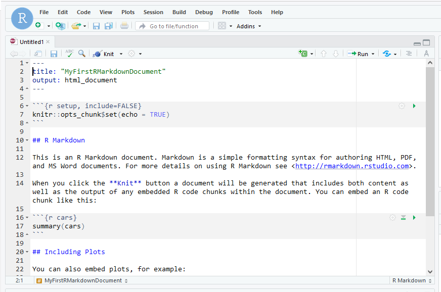

# **YAML (stands for Yet Another Markup Language) header**
At the top of an R Markdown document, you find the YAML (stands for Yet Another Markup Language) header. The YAML header controls the overall features of the document, including what type you produce (an HTML document, a Microsoft Word document, or a PDF), the font size and style, title, author, etc. The YAML header looks like this:

title: "Markdown basics"    
author: "Mairead Bermingham"    
date: "14/06/2022"    
output: html_document    


# **Code chunks**
Under the YAML header, you will find the first code chunk. Code chunks in an R Markdown document contain your R code. All code chunks start and end with three backticks (```).  
A code chunk looks like this:


\```{r chunk-name-with-no-spaces} 

\# your code goes here  

\```   

The first line contains `r`, the language and the name of the chunk: `chunk-name-with-no-spaces'. Specifying the language is mandatory. The chunk name is not required. However, it is good practice to give each chunk a unique name. The R Markdown file below contains two code chunks (figure 1):

{width=100%}

You can insert chunks like these into your file with

* the keyboard shortcut Ctrl + Alt + I 
* the 'Add Chunk' command in the editor toolbar
* or by typing the chunk delimiters \```{r} and ```\

When you render your R Markdown document, R Markdown will run each code chunk and embed the results beneath the code chunk in your output document.


## **Comment your code in the code chunks**
Comments are lines in our code that are not run by R. However they allow us to describe the intent of our code. So it is good practice to comment as you code.
<br>

## **Global Options**
To set global options that apply to every chunk in your file, call `knitr::opts_chunk$set` in a code chunk. Knitr will treat each option that you pass to `knitr::opts_chunk$set` as a global default that can be overwritten in individual chunk headers. 
```{r setup, include=FALSE}
knitr::opts_chunk$set(echo = TRUE)
```

## **Chunk Options**
You can add options to each code chunk. These options allow you to customise how or if you want code to be processed or appear on the rendered output document. The code chunk options are added on the first line of a code chunk after the name, within the curly brackets ('{}') of the chunk header.

Common chunk options include:

* eval = FALSE: Do not evaluate (or run) this code chunk when knitting the R Markdown document. The code in this chunk will still render in our knitted HTML output. However, it will not be evaluated or run by R.

* echo=FALSE: Hide the code in the output. The code is evaluated when the R Markdown document is knit. However, only the output is rendered on the output document.

* results=hide: The code chunk will be evaluated, but the results or code will not be rendered on the output document. This option is helpful if you are viewing the structure of a large object (e.g. outputs of a large data frame which is the equivalent of a spreadsheet in R).

* error = FALSE: R will stop on error when running the code chunks. Sometimes you may want to show errors on purpose (e.g., in an R tutorial). If you're going to show errors without stopping R, you can use the chunk option error = TRUE.

**Note:** Multiple code chunk options can be used for the same chunk.
<br>
<br>

# **Basic writing and formatting syntax**
Create sophisticated formatting for your text and code in R Markdown documents and Jupyter Notebooks with simple syntax.


## **Headings**
To create a heading, you need to add one to six # symbols before your heading text. The number of # you use will determine the size of the heading.  

# The largest heading            
## The second largest heading    
###### The smallest heading      

<br>
<br>

## **Styling text**
You can indicate emphasis with bold, italic, strikethrough, subscript, or superscript text in comment fields:
---
<br>

|Style                 |Syntax         |Output                               |
|----------------------|---------------|-------------------------------------|
|Bold                  |** **          |**This is bold text**                |  
|Italic                |* *            |*This text is italicised*            |  
|All bold and italic   |*** ***        |***This text is important***         |  
|Bold and nested italic|** ** and _ _  |**This text is _really_ important**  | 
|Strikethrough         |~~ ~~          |~~This text is crossed out~~         | 
|Subscript             |\<sub> \</sub> |<sub>This is a subscript text</sub>  | 
|Superscript           |\<sup> \</sup> |<sup>This is a superscript text</sup>|  

<br>

## **Inline code**  
Code can be inserted directly into the text of an R Markdown document by enclosing the code with \`r\`. For example, I used the function `head()` from the *base* R package to return the first six rows of my data frame.  

<br>
<br>

## **Lists**
You can make an unordered list by preceding one or more lines of text with * or -:

* Care assistant
* Occupational therapist
* Social worker
* Nurse

To order your list, precede each line with a number:

1. Care assistant  
2. Occupational therapist  
3. Social worker  
4. Nurse  
<br>

### **Nested Lists**
You can create a nested list by indenting one or more list items below another item: 
* Care assistant
  * Occupational therapist
    * Social worker
      * Nurse
<br>
<br>

## **Tables**
To add a table, use three or more hyphens (---) to create each column’s header, and use pipes (|) to separate each column. For compatibility, you should also add a pipe at the beginning and end of each row.
The rendered output looks like this:

| Syntax      | Description |
| ----------- | ----------- |
| Header      | Title       |
| Paragraph   | Text        |
<br>

## **Links**
You can create an inline link by wrapping link text in brackets [ ] and then wrapping the URL in parentheses ( ). 
For example:
Here is a helpful R Markdown resource:
[The R Markdown cheatsheet](https://eu01.alma.exlibrisgroup.com/leganto/public/44UOE_INST/citation/37711403400002466?auth=SAML).
<br>
<br>


## **Images** 
You can display an image in the text field by adding ! and wrapping the figure caption text in [ ]. Then wrap the link for the image in parentheses ().
For example:
The output documents can be nicely formatted PDFs, Word files, slideshows, and more (figure 2).

)](../Figures/Images/rmarkdownoutputformats.png){width=50%}
<br>
<br>

I hope these examples have improved your programming skills this week. Happy coding!
