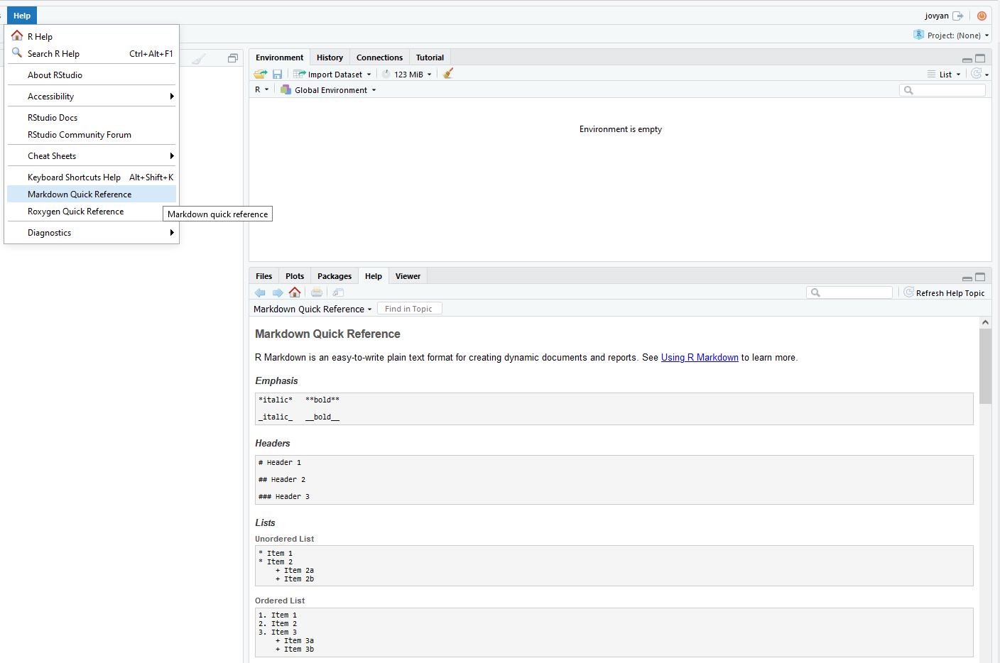
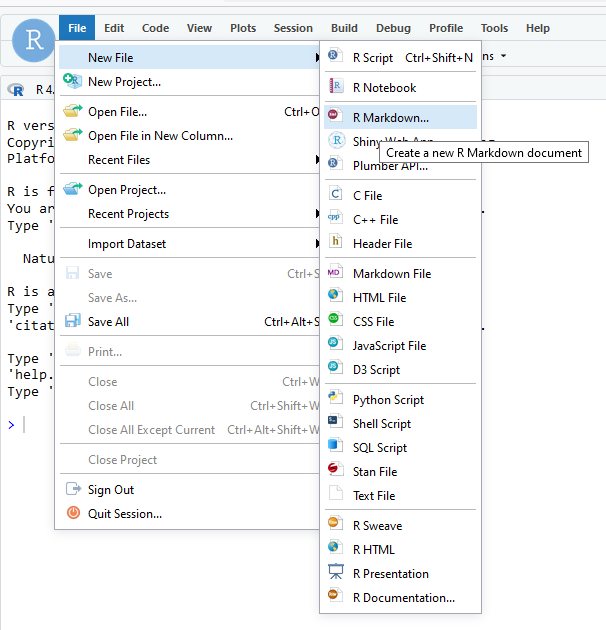
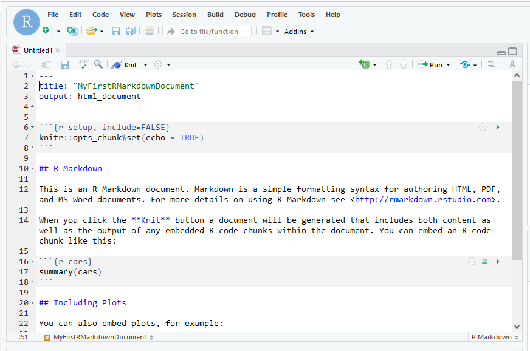
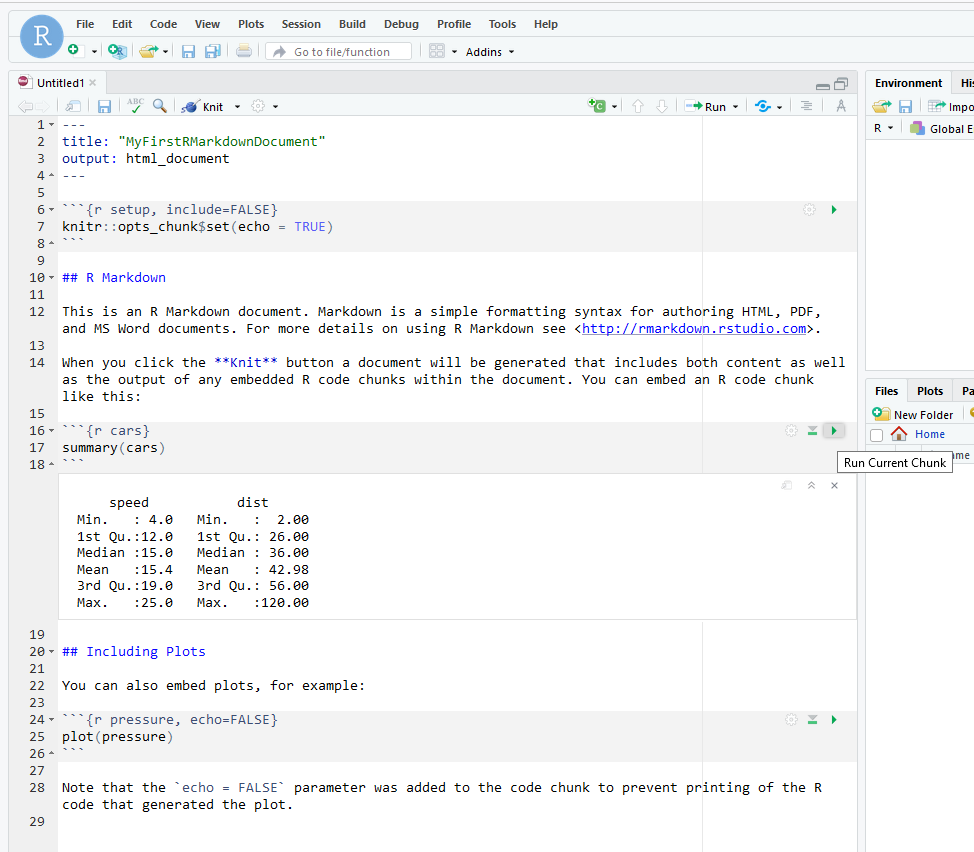
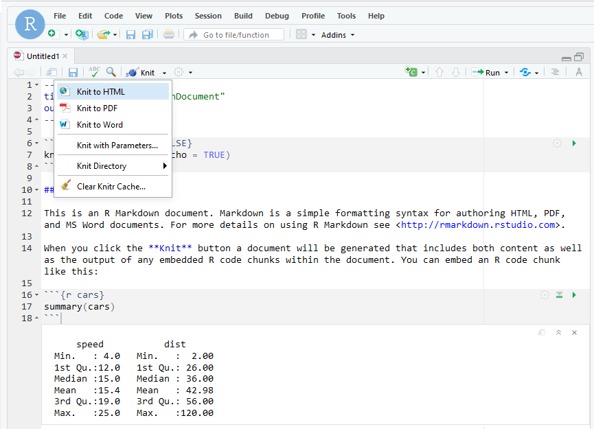
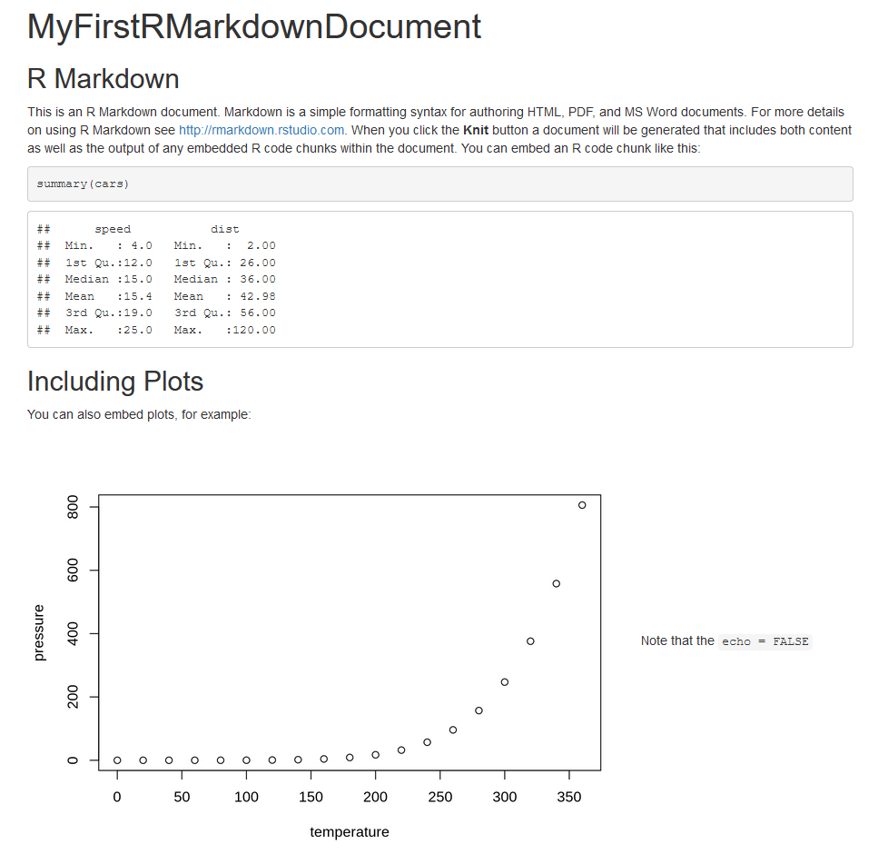

```{r setup, include=FALSE}
knitr::opts_chunk$set(echo = TRUE)
```

# **R Markdown**

R Markdown is a combination of Markdown (a lightweight markup language for formatting text documents) and R code within it (usually to process data, run analyses and produce tables and plots). R scripts have the file extension .R, Markdown documents have a file extension .md; therefore, R Markdown documents are .Rmd.
Within RStudio there is a Quick reference guide (figure 1) and links to the [RStudio cheatsheets](https://eu01.alma.exlibrisgroup.com/leganto/public/44UOE_INST/citation/37711420600002466?auth=SAML) can be found in the Help drop-down menu.


{width=100%}


Here are three more helpful resources:

•	[The R Markdown cheatsheet](https://eu01.alma.exlibrisgroup.com/leganto/public/44UOE_INST/citation/37711403400002466?auth=SAML)

•	[The R Markdown reference guide](https://eu01.alma.exlibrisgroup.com/leganto/public/44UOE_INST/citation/37711415410002466?auth=SAML)

•	[R Markdown quick tour](https://eu01.alma.exlibrisgroup.com/leganto/public/44UOE_INST/citation/37711529450002466?auth=SAML)


<br>

# **How does R Markdown work?**

Creating documents with R Markdown starts with an .Rmd document that contains a combination of markdown (content with simple text formatting) and R code chunks. The .Rmd document is fed to knitr, which executes all of the R code chunks and creates a new markdown (.md) document which includes the R code and its output (figure 2). The *knitr* package is an engine for dynamic report generation with R.

).](../Figures/Images/rmarkdownflow.png){width=100%}


The markdown document generated by *knitr* is then processed by pandoc, which is responsible for creating the finished format. Pandoc is a universal document converter.

This may sound not very easy, but R Markdown makes it extremely simple by capturing all of the above processing into a single render function. Better still, RStudio includes a "Knit" button that enables you to render an .Rmd and preview it using a single click or keyboard shortcut.

<br>
<br>

## **Create an R Markdown document**
To create an R Markdown document, go to the 'File tab', then 'New File', and finally, select 'R Markdown document' (figure 3).
<br>

{width=100%}

<br>
<br>

This is an R Markdown document, a plain text file with the extension .Rmd (figure 4):


{width=100%}

<br>
<br>

The R Markdown document contains three types of content:

* An (optional) YAML header surrounded by ---s  

* R code chunks surrounded by ```s  

* text mixed with simple text formatting  

<br>
<br>

## **R Markdown a notebook interface for R**
When you open the R Markdown document in the RStudio, it becomes a notebook interface for R. You can run each code chunk by clicking the run icon (figure 5). RStudio, similar to the Jupyter Notebook, executes the code and displays the results inline with your document:

{width=100%}
<br>

Lets run the chunk of code from my 'MyFirstRMarkdownDocument' R Markdown document below by clicking the run icon.
<br>
<br>
```{r cars}
summary(cars)
```
<br>
<br>

## **Rendering output**
To transform your R Markdown document into an HTML, PDF, or Word document, click the “Knit” icon above your document in the scripts editor (figure 6). A drop-down menu will let you select the type of output you want. Lets select HTML. HTML (HyperText markup language) is the code used to structure a web page and its content.

{width=100%}

<br>
<br>

Here is how the MyFirstRMarkdownDocument R Markdown document would look in HTML format:  

{width=100%}

<br>
R Markdown generates a new document containing selected text, code, and results from the .Rmd document. The output documents can be nicely formatted PDFs, Word files, slideshows, and more (figure 8).


)](../Figures/Images/rmarkdownoutputformats.png){width=50%}

<br>

R Markdown documents are fully reproducible and are designed to be used in three ways: 

1.	For communicating to decision-makers who want to focus on the conclusions, not the code behind the analysis.  

2.	For your future self and collaborators who are interested in your data insights and how you obtained them (i.e. your data, procedures, results and code). 

3.	As a lab notebook, you can capture what you do and what you are thinking.  

