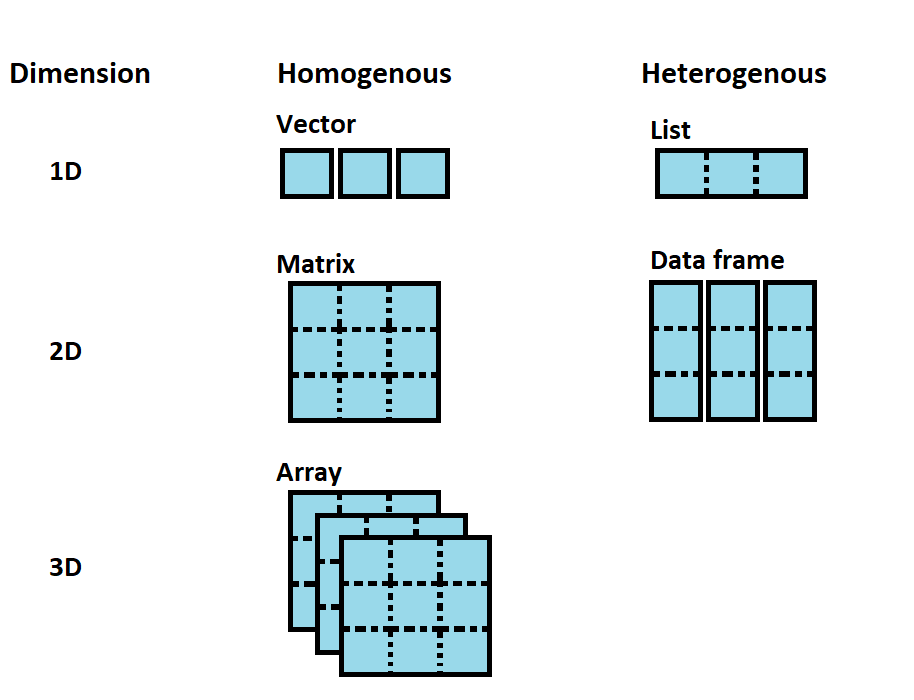
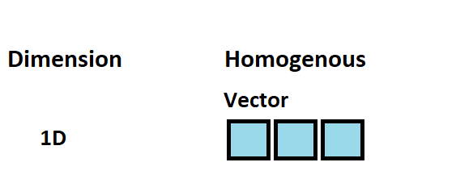
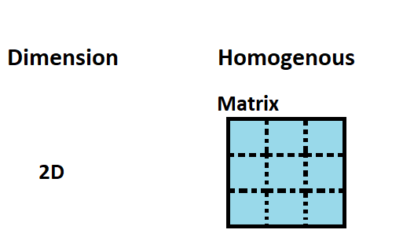
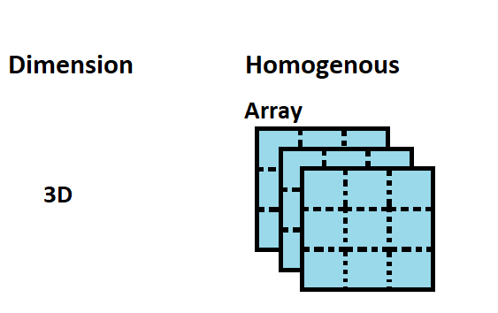
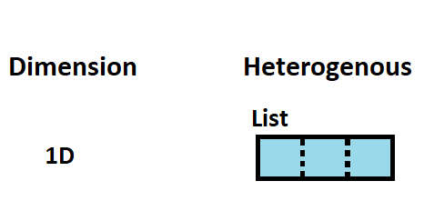
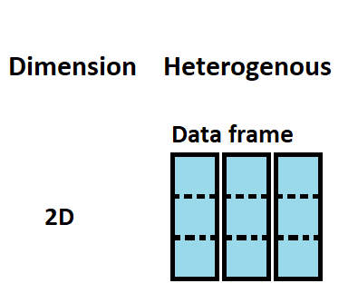

```{r setup, include=FALSE}
knitr::opts_chunk$set(echo = TRUE)
```

# **Understanding data types in R**  

R has several core data structures (figure 1) including

* Vectors
* Matrices
* Arrays
* Lists
* Data frames

{width=50%}

Let us discuss each of these data structures one by one. 
 


## **Vectors** 

Vectors are the basic data structure in R, upon which all other objects are built. The elements of a vector are all of the same data type, i.e. they are homogeneous. In contrast, list elements can be of different type (figure 2), i.e. they are heterogeneous.

{width=50%}

There are six types of  vectors: 

* Character  

* Integer 

* Numeric 

* Logical 

* Complex 

* Raw  


### **Combine Values into a vector** 

Vectors are generally created using the `c()` function. The `c()` function combine values into a vector or list. 
```{r av}
a <- c(-5, 6, -3, 9, 15,26)
a
#What is vector type is it?
typeof(a)
#How long is the vector?
length(a)
```

Since, a vector must have elements of the same type, the `c()` function will try and coerce elements to the same type, if they are different. Coercion is from lower to higher types, from logical to integer to double to character.

```{r bv}
#From logical to integer
b <- c(1,TRUE, FALSE,4,5)
b
#From double to character
ba <- c(1.0, "Service user",15.5, 10.8, "Social Care")
ba
```


#### **Character vectors** 
Character strings are symbols, letters, words or phrases inside double or single quotation marks. Let's create a character vector:
```{r awa}
character_vector<-c("Service user", "Healthcare", "Social care", "Care system")
character_vector
typeof(character_vector)
```

#### **Integer vectors**
The  integer data type specifies real values without decimal points, i.e., 1, 12, 20, and −4 are integers, 1.0, 11.5, 20.1, and −4.3 are not. Let's create an integer vector:
```{r awb}
integer_vector<-c(1,2,3)
integer_vector
typeof(integer_vector)
```

#### **Numeric vectors**
In R, the  numeric data type represents all real numbers with or without decimal values. The *base* R package function 'numeric()' method creates or coerces objects of type “numeric”.  Let's create a numeric vector from the integer_vector:
```{r awc}
numeric_vector<-as.numeric(integer_vector)
numeric_vector
typeof(numeric_vector)
```
#### **Logical vectors**
The logical data type in R is also known as the Boolean data type. It can only have two values: TRUE and FALSE.  create a logical vector:
```{r awd}
logical_vector<-c(FALSE, TRUE, TRUE, TRUE, FALSE)
logical_vector
typeof(logical_vector)
```


#### **Complex vectors**
The complex data type is an object that includes an imaginary number (i). As imaginary numbers are not generally used in statistics, this data type is not very common. The *base* R `as.complex()` function tries to coerce its argument to be of complex type. Let's create a complex vector:

```{r awe}
complex_vector<-c(as.complex(1 + 2i) , as.complex(2 + 3i),  as.complex(5 - 2i),  as.complex(3 + 2i),  as.complex(4 + 8i))
complex_vector
typeof(complex_vector)
```
#### **Raw vectors**

The raw data type holds raw bytes, so it is a very unusual data type. For instance, you could transform a character object or a integer numeric value to a raw object with the charToRaw() and intToBits() The *base* R `as.raw()` function tries to coerce its argument to be raw. Let's create a raw vector using the `charToRaw()` function:
```{r awfa}
charToRaw("Service user")
charToRaw("Healthcare")
raw_vector_charcter<-c(charToRaw("Service user"), charToRaw("Healthcare"))
raw_vector_charcter
typeof(raw_vector_charcter)
```

Let us create a raw vector using the `intToBits()` function:
```{r awfb}
intToBits(1)
intToBits(100)
raw_vector_integer<-c(intToBits(1), intToBits(100))
raw_vector_integer
typeof(raw_vector_integer)
```

### **Generating sequenced vectors**
Sequences are used in many different tasks in R, from plotting the axes of graphs to generating simulated data. Note that we will be creating more vectors.
You can create a vector with a sequence of numbers by using the `:` operator and the `seq()` and `rep()` *base* R package functions.

#### **Making sequences using the `:` operator**
The simplest way to create a sequence of numbers in R is by using the `:` operator. 
Let's give it a try:
```{r cav}
# Generate a sequence from 1 to 10 
1:10
```
What happens if we code 10:1?
Let's give it a try:
```{r cbv}
# Generate a sequence from 10 to 1 
10:1
```
It generates an inverse sequence of 10 to 1 by counting backwards in increments of 1. This is very useful for plotting coefficients from models in reverse order.

#### **Making sequences using using the `seq()` function**
The most basic use of the `seq()` function does exactly the same thing as the ':' operator. 
Let's try:
```{r ccv}
seq(1, 10)
seq(10, 1)
```
This provides the same output as 1:10 and 10:1.

##### **`seq()` function  arguments**  
The first two arguments are “from =” and “to =”. In R, you do not have to specify the arguments by name if you write out their values in the same order as written in the function. However, for complex functions, it is often best practice to do so and makes your code much clearer. For example, `seq(from = 1, to = 10)` will give the same output as seq(1, 10). 
Lest try:
```{r cdv}
seq(from = 1, to = 10)
```
The third argument is “by =”. Let’s say that instead of a vector of 1 to 10, you want a vector of numbers ranging from 1 to 10, incremented by 0.5. ==
Let's try:
```{r cev}
seq(1, 10, by = 0.5)
```
For help with this function, type `help(seq)` on your RStudio Console. 

#### **Making sequences using using the `rep()` function**
The `rep()` function generates repetitions. The arguments are “times =” and “each =”.
Let’s say that we want to create a vector that contains five zeros. We can do this with the `times=` argument:
```{r cfv}
rep(0, times = 5)
```

Let's create vector containing 2 repetitions of the vector (1, 3).  
```{r cgv}
rep(c(1, 3), times = 2)
```

Finally, let’s say that rather than repeating the vector (1, 3) over and over again, we want our vector to contain 2 ones, then 2 threes. We can do this with each argument:
```{r chv}
rep(c(1, 3), each = 2)
```
For help with this function, type `help(rep)` on your RStudio Console. 
 
## **The recycling rule**
Vectors of various sizes can be combined as long as the length of the longer vector is a multiple of the shorter vector's length. Otherwise, a warning is issued, although the operation is carried out. Let's test out the recycling rule using the correct dimensions:
```{r dv}
c<-c(1,2,3)
c
d<-rep(c, times = 3)
d
e<-rep(c(1,2,3), each = 3)
e
c+e
```
The operation is equivalent to `d`+`e`.

Let's test out the recycling rule using the incorrect dimensions:
```{r dav,error = TRUE}
d
f=c(4,5)
f
d+f
```


## **Working with vectors**
### **Vector operations** 
Operations are always done over all the elements of a numeric vector:
```{r ev}
print(a)
# Calculate the square of every element in vector a:
a*a
# Calculate the inverse of every element in vector a:
1/a
# Subtract five from every element in vector a and assign the result to ab:
ab<-a-5
ab
```


### **Accessing vector elements**
Elements of a vector can be accessed using vector indexing. Indexing in R is a way to refer to the individual items by their position. In other words, you can directly access your elements of choice. In R, objects are “one-indexed” meaning the position count starts at one. The vector used for indexing can be a logical, integer or character vector.

#### **Using integer vector as index**
We can use a vector of integers as an index to access specific elements. the R `print()` function prints values.
Let us access the third element of vector a:
```{r fv}
print(a)
a[3]
```
Let us access the first and fifth elements of vector a:
```{r gv}
a[c(1,5)]
```
Let us access all but the second element:
```{r hv}
a[-2]
```
It is not possible mix positive and negative integers while vector indexing
```{r iv, error=TRUE}
a[c(-2,4)]
```

Numeric (double) values will be truncated to integers
```{r jv, error=TRUE}
a[c(2.134,4.554)]
```


#### **Using logical vector as index**
When we use a logical vector for indexing, the position where the logical vector is TRUE is returned.
let us use a logical vector to filter the vector a:
```{r kv}
print(a)
a[c(FALSE, FALSE, TRUE, TRUE)]
```

You can also filter vectors based on conditions:
```{r lv}
a[a<1]
a[a>-1]
```
In the example above, the expression `a<1` will yield a logical vector (TRUE, FALSE, TRUE, FALSE, FALSE,FALSE), and `a>-1` a logical vector (FALSE, TRUE, FALSE, TRUE, TRUE, TRUE) which are then used for indexing.


#### **Using character vector as index**
This type of indexing is useful when dealing with named vectors. 
Lest name each elements of the vector a :

```{r mv}
ac <- c("first"=-5, "second"=6, "third"=-3, "fourth"=9, "fifth"=15,"sixth"=26)
names(ac)
ac["fourth"]
ac[c("fourth", "sixth")]
```


```{r nv}
print(a)
names(ac)
ac["fourth"]
ac[c("fourth", "sixth")]
```

#### **Clear the R environment**
R can run into memory issues. It is a common problem to run out of memory after running R scripts for a long time. To inspect the objects in your current R environment, you can list the objects and remove objects that are currently not in use. A good practice when running long lines of computationally intensive code is to remove temporary objects after they have served their purpose. The *base* R package `rm()` function removes objects from the the R environment. The  `rm()` function list argument is the a character vector naming objects to be removed. The *base* R package `ls()` function  returns a vector of all named objects visible in the environment. 

Let's clear the R environment be for moving on to matrices:
```{r ov}
ls()
rm(list = ls())
ls()
```
The code above will delete all the objects in the R environment and let you start with a clean slate as you progress to the next section.

**Note**, all the code above does is delete user-created objects from the R environment. The problem is that `rm(list = ls())` does **NOT**, in fact, create a fresh R process. All this code does is delete the objects you created from the R environment, which means that there may still be hidden dependencies (libraries or functions) that you are unaware of, but that will prevent your code from running for your future self or your collaborators.


## **Matrices** 
Matrices are a special type of vector in R. Matrices are used to depict the data in a structured and well-organised form. They are not a separate class of objects but simply a vector with dimensions added onto it. The data elements in matrices must be of the same type. (figure 3) A matrix is a collection of numbers arranged into a fixed number of rows and columns. Usually, the numbers are real numbers.  


{width=50%}

The *base* R matrix() function creates a 2-dimensional array that has m number of rows and n number of columns. 
The R matrix() function arguments include:  

*  *data:* The collection of elements that R will arrange into the rows and columns of the matrix

*  *nrow:*  Number of rows    

*  *ncol:*  Number of columns  

*  *byrow:* The rows are filled from left to right. If we want the matrix to be filled by the columns, i.e. the values are filled top to bottom, we need to use `byrow = FALSE` (default values). The *base* R package `dim()` function retrieves or sets the dimension of an object. The *base* R package `attribute()` function is used to get all the attributes of data.
Let's construct a matrix column-wise:
```{r am}
a <- matrix(1:18, nrow = 3, ncol = 6)
a
dim(a)
attributes(a)
```
If we want the matrix to be filled by the row, i.e. the values are filled row by row, we need to set  `byrow =` argument to `TRUE`.
Let us construct a matrix row-wise:
```{r abm}
a <- matrix(1:18,nrow = 3, ncol = 6, byrow = TRUE)
a
dim(a)
attributes(a)
```

### **Accessing matrix elements**
Elements of a vector can be accessed using matrix two integer 
indexing. 
```{r acm}
# Extract the value in the 3rd row and 4th column
a[3,4]
# Extract the values for the third row
 a[3,]
# Extract the values for the third column
 a[,3]
 ```
 By default, extracting a single element or a single row or a single column returns a vector, not a matrix (this can be changed by setting the argument `drop=` to `FALSE`)
 
```{r adm}
# Extract the value in the 3rd row and 4th column
a[3,4,drop=FALSE ]
# Extract the  the values for the third row
 a[3,, drop=FALSE]
# Extract the  the values for the third column
 a[,3, drop=FALSE]
 ```
### **Accessing matrix elements by row and column names** 
If we assign names to the rows and columns of the matrix, then we can access the elements by names. The *base* R package `dimnames()` function is used to set or query the row and column names of a matrix. 
Let's add row and column names to a matrix:
```{r aem}
a
dimnames(a) = list( 
c("row1", "row2", "row3"),                          # Row names 
 c("col1", "col2", "col3","col4", "col5", "col6"))  # Column names 
 a # print a
 
 a["row3", "col4"] # Element at third row, fourth column 
```
 
### **Matrix operations** 


#### **Multiplication by a scalar** 
Scalar multiplication refers to the product of a real number and a matrix. In scalar multiplication, each entry in the matrix is multiplied by the given number.
```{r afm}
 a <- matrix(1:18, nrow = 3, ncol = 6)
 a
 b<-3
 b*a
 ```
Each entry in the matrix has been multiplied by the given scalar.  
 
#### **Matrix addition and subtraction**
 
 The operators '+' and '-' are used for addition and subtraction in R respectively.
 ```{r agm}
 a
 c<-matrix(-1:-18, nrow = 3, ncol = 6)
 c
 a+c
 a-c
 ```
The addition of matrices a and c yields a matrix where every element is the sum of corresponding elements of the input a and c matrices. The subtraction of matrices a and c produces a matrix where every element is the difference of corresponding elements of matrix c (the second matrix) from a (the first matrix).

#### **Matrix multiplication** 
The first matrix must have the same number of columns as the second matrix has rows to perform matrix multiplication. The operator '%*%' is used for matrix multiplication in R.
 
 ```{r ahm,error=TRUE}
 #Non-conformable matrix multiplication
 a
 c
 a %*% c
 #Conformable matrix multiplication
 d<-matrix(-1:-18, nrow = 6, ncol = 3)
 d
  a %*% d
 ```

#### **Matrix transposition** 
Transpose of a matrix is an operation in which we convert the rows of the matrix into columns and columns of the matrix into rows. The *base* R package `t()` function returns the transpose of a matrix.
 ```{r aim,error=TRUE}
a
t(a)
 
 ```
The rows of matrix a have been converted to columns, and columns of the matrix a to rows.

#### **Clear the R environment**
Let's clear the R environment be for moving on to arrays:
```{r om}
ls()
rm(list = ls())
ls()
```


## **Arrays** 
Arrays are multi-dimensional data structures. In an array, data is stored in the form of matrices, rows, and as well as in columns. For example, if we want to create an array of dimensions (2, 3, 4), then the array includes four rectangular matrices, each with two rows and three columns. The *base* R package `array()` function is used to create an array. Arrays can store only data of one type (figure 4).

{width=50%}

The `array()` function takes vectors as input and uses the values in the dim argument to create an array.
Let's create an array of two 3x3 matrices each with 3 rows and 3 columns.
```{r aa}
# Create two vectors of different lengths.
a <- c(-1,0,1)
b<-c(0,1,2,3,4,5)
# Take vectors a and b as input to the array() function
c<- array(c(a,b),dim = c(3,3,2))
print(c)
```
### **Naming columns, rows and matrices in the array** 
We can use the `array()` function `dimnames=` argument for giving names to the rows, columns and matrices in the array.

```{r ab}
# Two vectors of different lengths.
a 
b
column.names <- c("COL1","COL2","COL3")
row.names <- c("ROW1","ROW2","ROW3")
matrix.names <- c("Matrix1","Matrix2")
# Take vectors a and b as input to the array() function
c<- array(c(a,b),dim = c(3,3,2), dimnames = list(row.names,column.names, matrix.names))
print(c)
```

### **Accessing array elements**
We can use the matrix level, row index, and column index to access the matrix elements. 

```{r ac}
#Array
c
# Print the first row of the first matrix of the array.
print(c[1,,1])

# Print the element in the 1st row and 2nd column of the 2nd matrix.
print(c[1,2,2])

# Print the 2nd Matrix.
print(c[,,2])
```

### **Array operations** 

#### **Manipulating array elements**

An array stores matrices in multiple dimensions, the operations on elements of the array are carried out by accessing elements of the matrices.


```{r ad}
#Create matrices from array c
c
matrix1 <- c[,,1]
matrix2 <- c[,,2]

# Add the matrices.
matrix3<- matrix1+matrix2
print(matrix3)
```
#### **Using the `apply()` function to do calculations across array elements**
The *base* R package `apply()` function is used to repetitively perform an action on multiple chunks of data.
The `apply()` function arguments include: 

* **x:** is an array or matrix (this is the data that you will be performing the function on) 

* **margin:** specifies whether you want to apply the function across rows (1) or columns (2)

* **fun:**  is the function you want to use  


Let's calculate the sum of the rows across the two matrices in array c:

```{r ae}
# Array c
c
# Use the apply() function to calculate the sum of the rows across the two matrices
d <- apply(c, c(1), sum)
print(d)
```
#### **Clear the R environment**
Let's clear the R environment be for moving on to lists:
```{r af}
ls()
rm(list = ls())
ls()
```


## **Lists**

Lists are ordered collections of objects where the elements can be of a different type (a list can be a combination of matrices, vectors, other lists, etc.). Unlike vectors, its contents are not restricted to a single data type and can encompass any data type, i.e. they are heterogeneous (figure 5). Lists are sometimes called recursive vectors because a list can contain other lists. This makes them fundamentally different from vectors. Lists are extremely useful inside functions. You can bring together lots of different kinds of outputs into a single object that a function can return.

{width=50%}

The *base* R package `list()` function is used to create a list.  We can check if it’s a list with `typeof()` function and find its length using `length()`. The  structure of a list can be examined with the 'str()' function.  The *base* R package 'str()' function  is used for compactly displaying the internal structure of a R object. 
```{r la}
a <- list(name="Mairead Bermingham", courses=c("Working with data types and structures in Python and R"), date=format(Sys.time(), '%d %B, %Y'), consent=c(TRUE), accessed_Learn_times_per_week=as.integer(c(10, 16, 6)) , learning_hours_per_week=c(20.1, 19.5, 12.4))
a
#What is a's data structure
typeof(a)
#How many elements are in list a?
length(a) 
#What are the names of the elements in list a?
names(a)
#What is the internal structure of the list
str(a)
```
Here, we create a list “a” of three components with data types character, character, date, logical (Boolean), integer and numeric vector, respectively.
In this example, name, courses, date and consent are called tags which makes it easier to reference the components of the list.

However, tags are optional. We can create the same list without the tags as follows. In such scenario, numeric indices are used by default.
```{r laa}
aa <- list("Mairead Bermingham", c("Working with data types and structures in Python and R"), format(Sys.time(), '%d %B, %Y'), c(TRUE), as.integer(c(10, 16, 6)), c(20.1, 19.5, 12.4))
aa
```


Lists can be concatenated to generate bigger lists. If we have three lists, we can create a unique list which is the result of the union of these three lists:
```{r lc}
#Create three lists using the list() function
aa<-list(name="Mairead Bermingham", courses=c("Working with data types and structures in Python and R"), date=format(Sys.time(), '%d %B, %Y'))
aa
ab<-list(consent=c(TRUE))
ab
ac<- list(accessed_Learn_times_per_week=c(10, 16, 6) , learning_hours_per_week=c(20.1, 19.5, 12.4))
ac
#Concatenate the three lists 
aabc<- c(aa, ab, ac)
aabc
```


Vectors can be coerced to lists as follows:
```{r ld}
b <- c(1:10)
b
b <- as.list(b)
b
typeof(b)
length(b)
```
A list does not print out like a vector. It prints a new line for each element.  

### **Accessing list elements**
List elements are indexed by double brackets:
```{r le}
a[[1]]
```
Single brackets will still return another list:
 ```{r lf}
a[1]
```
Indexing with single brackets(`[]`) as shown above will give us a sublist, not the content inside the component. To retrieve the content, we need to use double brackets (`[[]]`).

Alternatively, ff the elements of a list are named, they can be referenced by the `$` notation:
 ```{r lg}
a$learning_hours_per_week
```

### **List  operations** 

#### **Modifying list elements**
We can change elements of a list through reassignment.
 ```{r lh}
 a
a[["name"]] <- "Mairead Lesley Bermingham"
a
```

#### **Deleting list elements**
We can delete an element by assigning NULL to it.
 ```{r li}
a
a[["accessed_Learn_times_per_week"]] <- NULL
a
a[["learning_hours_per_week"]] <- NULL
names(a)
a
```


#### **Adding new list elements**
Adding new components is easy. We simply assign values using new tags and it will pop into action.
```{r lj}
a
a[["accessed_Learn_times_per_week"]] <- as.integer(c(10, 16, 6)) # add an integer element
names(a)
a
```

Alternatively, new elements can be added to list a by just defining them:
```{r lk}
a
a$learning_hours_per_week<-c(20.1, 19.5, 12.4) # add a numeric element
#What are the names of the elements in the list "a"?
names(a)
a
```

#### **Clear the R environment**
Let's clear the R environment be for moving on to data frames:
```{r ll}
ls()
rm(list = ls())
ls()
```


## **Data frame** 
A data frame is a very important data type in R. It is the most commonly used data structure for tabular data and what we use in data science. A data frame is an array. Unlike an array, the data stored in the columns of a data frame can be of various types (character, integer, numeric, etc.), i.e. they are heterogeneous (figure 6). All columns in a data frame have to be of the same length. Datasets read into R are stored as data frames by default.


### **Useful data frame functions:** 
* `head()`: shows first 6 rows
* `tail()`: shows last 6 rows
* `dim()`:  returns the dimensions of data frame (i.e. number of rows and number of columns)
* `nrow()`:  number of rows
* `ncol()`:  number of columns
* `str()`: structure of data frame - name, type and preview of data in each column
* `names()` or `colnames()`:  both show the names attribute for a data frame
* `sapply(dataframe, class)`:  shows the class of each column in the data frame


{width=50%}


The *base* R package `data.frame()` function is used to create data frames.  
By default, R converts character strings to factors when creating data frames directly with `data.frame()` function or as the result of using the *readr* package `read_csv()` function to read in tabular data. The *readr* package makes it easy to get tabular data out of comma-separated (csv) or tab-separated (tsv) and into R. The *tidyverse* package is a collection of R packages designed for data science. You can avoid converting character strings to factors by setting the `stringsAsFactors =' argument in the *base* R package `options()` function to `FALSE` when creating data frames.

Let's see how to define a data frame with two elements, a numeric vector and a character vector. Note that both vectors must be same length:
```{r da}
#Converts character strings to factors 
options(stringsAsFactors = TRUE)            # Default
a <- data.frame(BMI=c(18,20,25,29,30, 38),Weight_status=c("underweight","healthy weight","overweight","overweight","obese", "obese"))
a
a$Weight_status # Converted to a four levels factor!!
a$BMI           # Numeric vector of length = 6

mode(a) # Storage mode of the object
typeof(a) # Storage mode (internal) of the object
class(a)  # Object class

#Keep the character strings
options(stringsAsFactors = FALSE) 
a <- data.frame(BMI=c(18,20,25,29,30, 38),Weight_status=c("underweight","healthy weight","overweight","overweight","obese", "obese"))
a
a$Weight_status # character vector of length = 6
```
However, the most common way of defining a data frame is reading the data stored in a file, for example, using the *readr* package `read_csv()` function to read tabular data in a comma-separated values (csv) file.

### **Accessing data frame elements**
Because data frames are rectangular, elements of a data frame can be referenced by specifying the row and the column index in single square brackets (similar to a matrix).
```{r db}
a[3, 3]
```
As data frames are also lists, it is possible to refer to columns (which are elements of such a list) using the list notation, i.e. either double square brackets or a $ notation:
```{r dc}
a[["BMI"]]
a$BMI
```

### **Data frame operations** 

#### **Adding on to data frames** 
We can leverage the *base* R package `cbind()` function for adding columns to a data frame. Note that one of the objects being combined must already be a data frame otherwise `cbind()` will produce a matrix.
```{r dd}
a
#Add a new column
b<-c("Tom", "Mary", "Shelia", "Alex", "Han", "Binxu")
c<-cbind(a, b)
c
#Change the name of the new column to Name.
colnames(c)[3]<-"Name"
c
```
We can also use the `rbind()` function to add data frame rows together. However, severe caution should be taken because this can cause changes in the classes of the columns. The structure of a data frame can be examined with the 'str()' function. The *base* R package 'str()' function is used for compactly displaying the internal structure of an R object. 
```{r de}
a
##What is the internal structure of the list
str(a)

#Using rbind() to add an extra row of data
d<- data.frame(BMI = 23, Weight_status = "healthy weight")

d
aa<- rbind(a, d)
aa
#What is the internal structure of the updated data frame
str(aa)
```
Our columns are the same class as the original data frame.


#### **Adding attributes to data frames**
Similar to matrices, data frames will have a dimension attribute. In addition, data frames can also have additional attributes such as row names, column names, and comments. 

```{r df}
a
dim(a)
attributes(a)
```
Currently the data frame a does not have row names but we can add them with thw `rownames()` function:
```{r dg}
a
#Add row names
rownames(a) <- c("row1", "row2", "row3", "row4", "row5", "row6")
attributes(a)
```
We can also also change the existing column names by using the `colnames()` or `names()` function:
```{r dh}
a
#Change column names with colnames()
colnames(a) <- c("col1", "col2")
attributes(a)
```

#### **Subsetting data frames**
Data frames have the characteristics of both lists and matrices. If you subset with a single vector, they behave like lists and will return the selected columns with all rows. Whereas, if you subset with two vectors, they behave like matrices and can be subset by row and column. Let's subset the data frame a by row, by row names, like a list, like a matrix, by row and column and by a vector:

```{r di}
c
#Adding row names to data frame "c"
rownames(c) <- c("row1", "row2", "row3", "row4", "row5", "row6")
c
#Subsetting by row numbers
c[3:4, ]

#Subsetting by row names
c[c("row3", "row4"), ]

#Subsetting columns like a list
c[c("BMI", "Weight_status")]

#Subsetting columns like a matrix
c[ , c("BMI", "Weight_status")]

#Subsetting for both rows and columns
c[4:6, c(2, 3)]

#Using a vector to subset
v <- c(1, 3)
c[ , v]
```
You can also subset data frames based on conditional statements. 
If we want to subset the c data frame for all rows where BMI is greater than 24.5, we can perform this using brackets or the *base* R package 'subset()' function. The 'subset()' function return subsets of vectors, matrices or data frames which meet conditions. Let's try subsetting the “c” data frame:

```{r dj}
c
# Using brackets
c[c$BMI > 24.5, ]

# Using the subset function
subset(c, BMI > 20)
```

We can add to the conditional statement if we want to filter for multiple conditions.

```{r dk}
c
# Using brackets
c
# Using brackets
c[c$BMI > 24.5 & c$Name=="Han", ]

# Using the subset function
subset(c, BMI > 20 & Name=="Han")
```

If we want to perform this filtering and return only specified columns. We simply state the columns we want to return.
```{r dl}
c
# Using brackets
c
# Using brackets
c[c$BMI > 24.5 & c$Name=="Han", c("Weight_status", "Name")]

# Using the subset function
subset(c, BMI > 20 & Name=="Han", c("Weight_status", "Name"))
```
  
I hope these examples help you to improve your R programming skills. Happy coding!